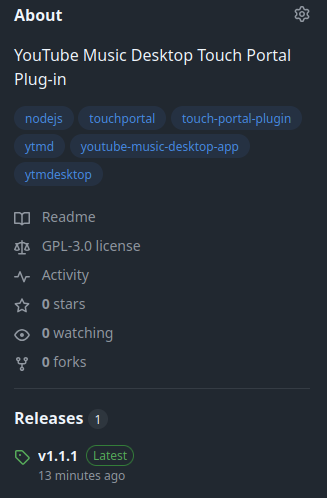
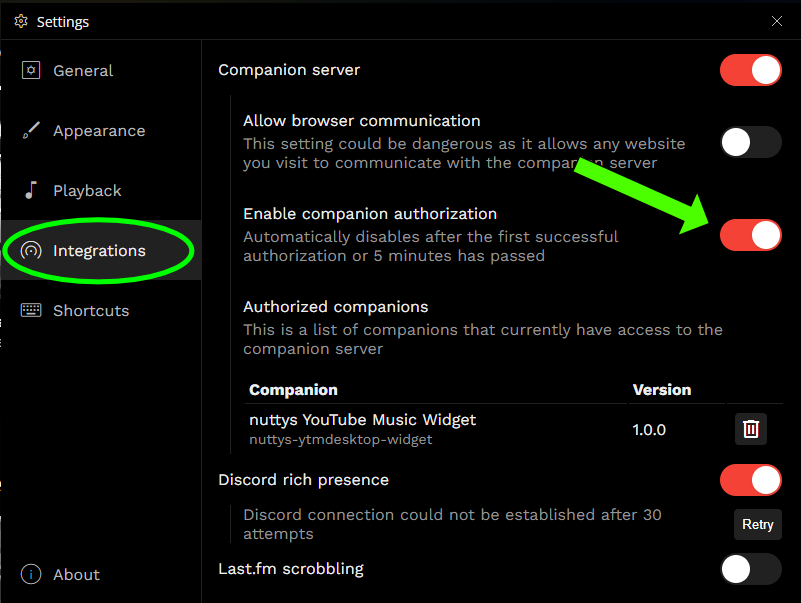
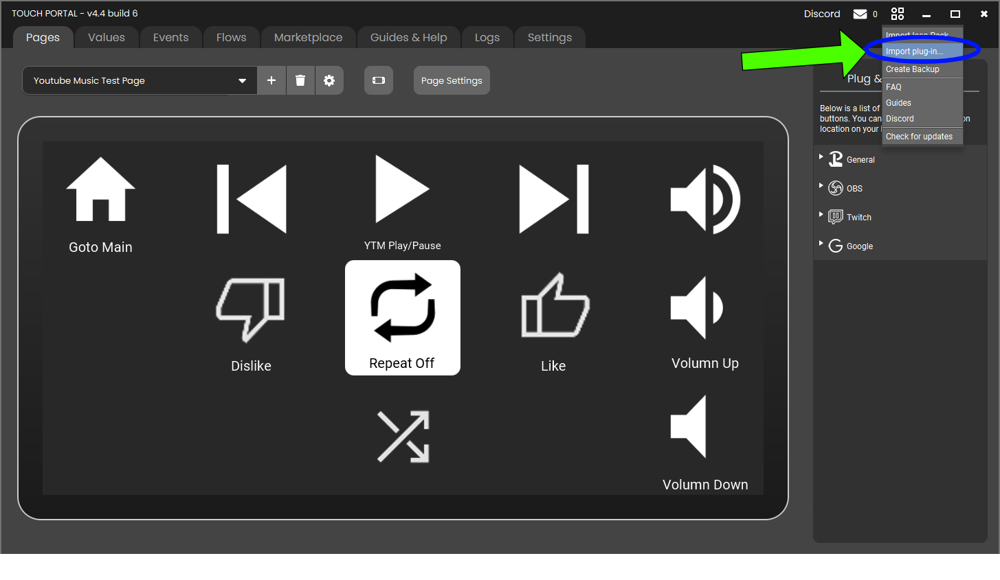
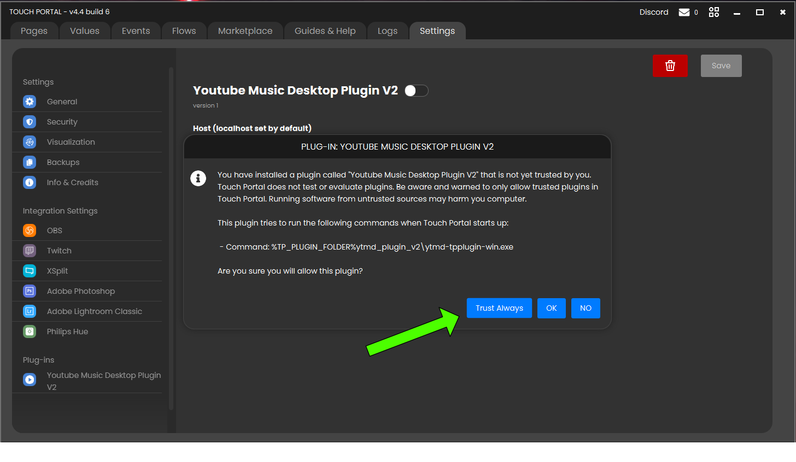
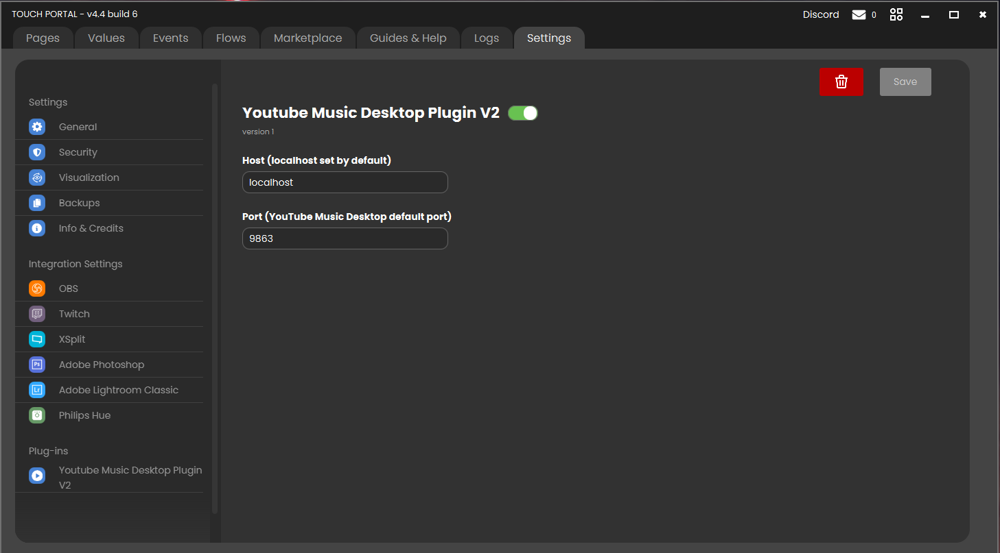
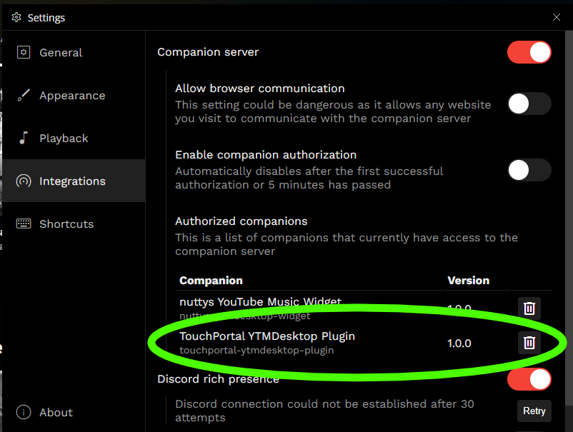

<a id="readme-top"></a>
# TouchPortal Youtube Music Desktop Plugin

## Description
This is a [Touch Portal](https://www.touch-portal.com/) plugin for the [YouTube Music Desktop Application](https://ytmdesktop.app/). 
I developed this app in NodeJS using version 20.20. The app is packaged as a NodeJS executable so that you **do not** need to install Node for this plug-in to run.

<div align="center" style="padding:8px">
  <a href="https://github.com/bcarbajal23/touchportal-ytmd-plugin/issues/new?template=bug-report.md">Bug Report</a>
  &middot
  <a href="https://github.com/bcarbajal23/touchportal-ytmd-plugin/issues/new?template=feature-request.md">Feature Request</a>
</div>

<details>
  <summary>Table of Contents</summary>
  <ol>
    <li>
      <a href="#Desciption">Description</a>
    </li>
    <li>
      <a href="#getting-started">Getting Started</a>
      <ul>
        <li><a href="#prerequisites">Prerequisites</a></li>
        <li><a href="#installation">Installation</a></li>
        <li><a href="#trouble-shooting">Trouble Shooting</a></li>
      </ul>
    </li>
    <li>
      <a href="#usage">Usage</a>
      <ul>
        <li><a href="#actions">Actions</a></li>
        <li><a href="#events">Events</a></li>
        <li><a href="#states">States</a></li>
      </ul>
    </li>
    <li><a href="#contributing">Contributing</a></li>
    <li><a href="#license">License</a></li>
    <li><a href="#contact">Contact</a></li>
    <li><a href="#acknowledgments">Acknowledgments</a></li>
  </ol>
</details>

## Getting Started 

### Prequisites
- Running Windows 10/11, MacOs (Intel, M1, M2), Linux (Ubuntu/Debian). 
- **For MacOs users with M3 chips or newer**. Unfortunately I cannot promise this plug-in may not work for you because of Apple's requirement of ad-hoc signature for apps to run on M3 chips or later (Rosetta 2). I used [@yao-pkg/pkg](https://www.npmjs.com/package/@yao-pkg/pkg) to create the executable and they explain the [issue here](https://www.npmjs.com/package/@yao-pkg/pkg#targets). More info about this issue directly from [Apple](https://support.apple.com/guide/security/rosetta-2-on-a-mac-with-apple-silicon-secebb113be1/web).

### Installation
1. Download and install [YouTube Music Desktop App](https://ytmdesktop.app/) version 2.0 or greater.
    _* You can also download it from their [github](https://github.com/ytmdesktop/ytmdesktop) as well._
2. Download and install [Touch Portal](https://www.touch-portal.com/) as well, version 4.0 or greater.
    _* You can skip this step if you already have it installed_
3. Download the latest version of the plugin over on the right side in the releases section or [click here](https://github.com/bcarbajal23/touchportal-ytmd-plugin/releases) and download the latest release.
<div align="center">
  
   
4. Open the YouTube Music Desktop App and click on the **settings cogwheel** on top right corner next to the home button.
5. Now Click on the **Integrations** tab on the left side of the panel and enable the **Companion server** toggle. This is an important step because this is how Touch Portal will be able to connect and communicate with Youtube Music.
6. Now enable the toggle for **Enable companion authorization**. Leave this window open while we set up the plug-in in Touch Portal.
<div align="center">
   
</div>

7. Open Touch Portal, click on the **Quick Actions** over on the top right corner of the app and click **Import plugin**.
<div align="center">
  
</div>

8. Once the plug-in has finished installing, you will prompted by Touch Portal to trust the plug-in. You may press *Trust Always* (recommended) or *Yes*. Clicking on *Trust Always* will never show you that pop-up again. Clicking *Yes*, you are only trusting the plug-in for this session of Touch Portal. You will be asked to trust the plug-in again the next time you  launch Touch Portal. 
<div align="center">
  
</div>
<p align="center">You should see the plug-in has been turned on in the Touch Portal Settings.</p>
<div align="center">
  
</div>

9. Once you trust the plug-in, you see the **Companion Authorization Request** module pop up from the YouTube Music Desktop App. Go ahead and click **Allow** to complete the intregration of the plug-in.
<div align="center">
  
</div>
 
 <div>
  <strong>Notes:</strong>
  <ul>
    <li>Sometimes the module may not pop-up over Touch Portal, you may have to focus on the YouTube Music Desktop App to see it.</li>
    <li>Windows Specific: You have to click on the YouTube Music App icon in the Taskbar</li>
  </ul>
 </div>  
 
10. Once the Companion Authorization Request has been approved, you should see the plugin listed in the **Companion** section of the YouTube Music App.
<div align="center">

</div>

11. Awesome! You've successfully installed the plug-in.😎 Now go ahead and start jamming! 🤘 💃 🕺

<p align="right">(<a href="#readme-top">back to top</a>)</p>

### Trouble Shooting
#### MacOS Users: "App is damaged" or "Unverified Developer"
If you see a warning that the plugin is "damaged and can't be opened" or "cannot be verified," this is because the plugin was not digitally signed by Apple. It is safe to use. (I do not own an Apple computer to sign the app/plug-in)

To fix this:
1.  Open your **Terminal** app.
2.  Run the following command (replace `/path/to/...` with the actual path to the plugin file inside your Touch Portal folder):
    ```bash
    xattr -cr "/Users/YOUR_USERNAME/PATH/TO/Touch Portal/plugins/ytmd_plugin_v2/ytmd-tpplugin-macos"
    ```
3.  Restart Touch Portal.

Alternatively, you can try:
1. Right-click the plugin file in Finder. (Same path as step 2 above).
2. Select **Open**.
3. Click **Open** in the dialog box that appears.

#### Windows Users: "Windows protected your PC"
If you see a blue "Windows protected your PC" window (SmartScreen):
1.  Click **More info**.
2.  Click the **Run anyway** button.

#### Other Issues
*Some issues I've noticed while developing the plugin*
1. "None of the actions work after installing (re-installing) the plug-in."
    - Solution: Press one of the buttons (Play work) in YouTube Music Desktop App should resolve the issue.
2. "The token modal is not popping up after installing"
    - Solution: Check that the modal is being blocked by Touch Portal, Youtube Music, or any other apps you might have open. 
    - **Sometimes** in Windows, the modal is minimized by the Taskbar. Clicking the YouTube Music App icon in the taskbar will make the modal disappear.
3. **Token Sync**: by default, YouTube Music Desktop App will only keep the modal open for 30 seconds, then is closes it. Try to resync by toggling the [**Enable companion authorization**](#installation) in step 6 of the installation process and togging the plugin in the Touch Portal Setting.
4. Restarting Touch Portal usually fixes some of the issues above.
5. If all else fails, delete the plug-in, restart Touch Portal and YouTube Music Desktop App, and re-install it following the step in the [installation](#installation) section.

<div align="center" style="font-size: 1.5em">
  <a href="https://github.com/bcarbajal23/touchportal-ytmd-plugin/issues/new?template=bug-report.md">Report Bug Here</a>
</div>

<p align="right">(<a href="#readme-top">back to top</a>)</p>

## Usage

<div style="display: flex; flex-direction:column">
<div style="align:center;padding: 8px;">
  
  </div>
  
  <div style="align:center;padding: 8px;">
  
  ### Actions
  - **Playback Play/Pause**: Allows user to Play & Pause the player. 
  - **Play Next Track**: Allows user to skip to the next track.
  - **Play Previous Track**: Allows user to play previous track or restart current one. 
  - **Mute/Unmute**: Allows user toggle between muting and unmuting the player 
  - **Volume Up**: Allows user to increase player value (uses default from YTMD app).
  - **Volume Down**: Allows user to decrease player value (uses default from YTMD app).
  - **Repeat Mode**: Allows user to cycle through repeat modes (NONE, ALL, ONE).
  - **Shuffle On/Off**: Allows user toggle shuffle mode on and off.
  - **Track Like/Dislike** Allows user to like or dislike track. 
  
  ### Events
  - **YouTube Music play state changes**: Triggers Play/Pause state of player.
  - **YouTube Music audio state changes**: Triggers if the volume is increased or decreased.
  - **YouTube Music repeat mode changes**: Triggers the Repeat Mode state of player **OFF/ALL/ONE**.
  - **YouTube Music shuffle mode changes**: Triggers Shuffle Mode state of player **ON/OFF**.
  - **YouTube Music track like/dislike changes**: Triggers the Like/Dislike state of track **INDIFFERENT/LIKE/DISLIKE**.

  ### States
  - **YouTube Music play state (Play or Pause)**: Current playback state of player (Play or Pause).
  - **YouTube Music audio state (Mutes or Unmuted)**: Current audio state of player (Muted or Unmuted)
  - **YouTube Music repeat mode (NONE, ALL, ONE)**: Current state of repeat mode (NONE, ALL, ONE). 
  - **YouTube Music shuffle mode (OFF, ON)**: Current state of shuffle mode (On or Off).
  - **Track Like/Dislike (DISLIKE, INDIFFERENT, LIKE)**: Current like/dislike state of song/video (DISLIKE, INDIFFERENT, LIKE).
  </div>
  
</div>

<p align="right">(<a href="#readme-top">back to top</a>)</p>

## Contributing
If you have any suggestions, feel free to fork the repo and create a pull request. You can also open a [**GitHub Issue**](https://github.com/bcarbajal23/touchportal-ytmd-plugin/issues/new?template=feature-request.md) for a feature request. Any contribution is **greatly appreciated**

1. Fork Project
2. Create your Feature Branch: `git checkout -b new-awesome-feature`
3. Commit your changes: `git commit -m feat: added cool new feature` 
    - Using [semantic-commit-messages](https://gist.github.com/joshbuchea/6f47e86d2510bce28f8e7f42ae84c716)
4. Push to your branch: `git push origin new-awesome-feature`
5. Open a Pull Request and assign it to me.

<p align="right">(<a href="#readme-top">back to top</a>)</p>

## License
Distributed on GNU General Public License. See [`LICENSE`](/LICENSE)for more information

<p align="right">(<a href="#readme-top">back to top</a>)</p>

## Contact
Carlos Carbajal 
Email: carlos@carbajal.dev

For any issues with the plugin or suggestions, create a GitHub Issue using one of the templates or feel free to email. 

Project Link: https://github.com/bcarbajal23/touchportal-ytmd-plugin

<p align="right">(<a href="#readme-top">back to top</a>)</p>

## Acknowledgments
Helpful resources that helped me develop the plugin:

- [Touch Portal Plugin API](https://www.touch-portal.com/api/index.php?section=intro) 
- [Touch Portal Node Api](https://github.com/spdermn02/touchportal-node-api)
- [ytmdesktop-ts-companion](https://xeroxdev.github.io/ytmdesktop-ts-companion/index.html)  

The project was inspired by original plugin written by [KillerBOSS](https://github.com/DamienStaebler/TP-YTDM-Plugin)


If you've made it this far, know that you matter and you're doing great. 🙂
<p align="right">(<a href="#readme-top">back to top</a>)</p>
